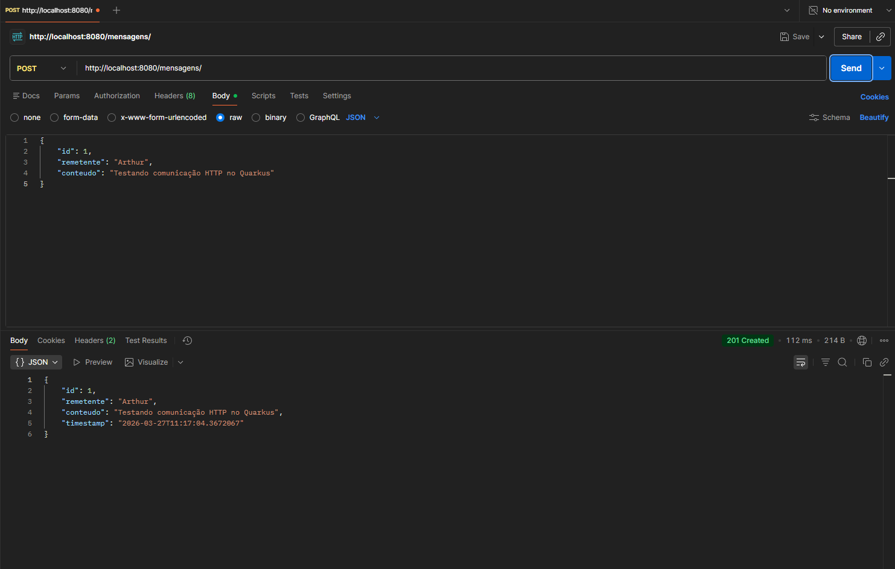
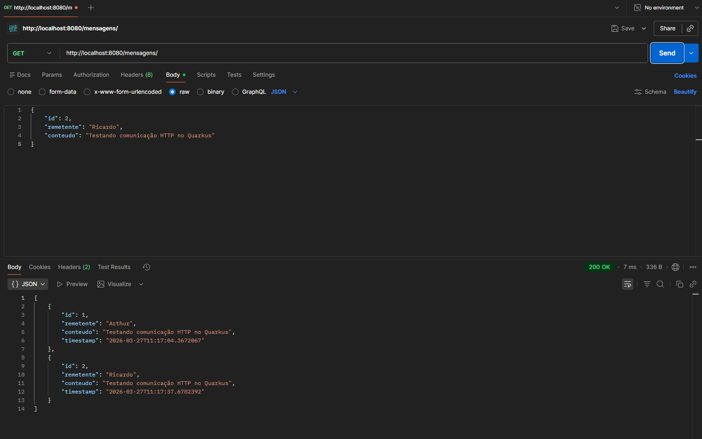
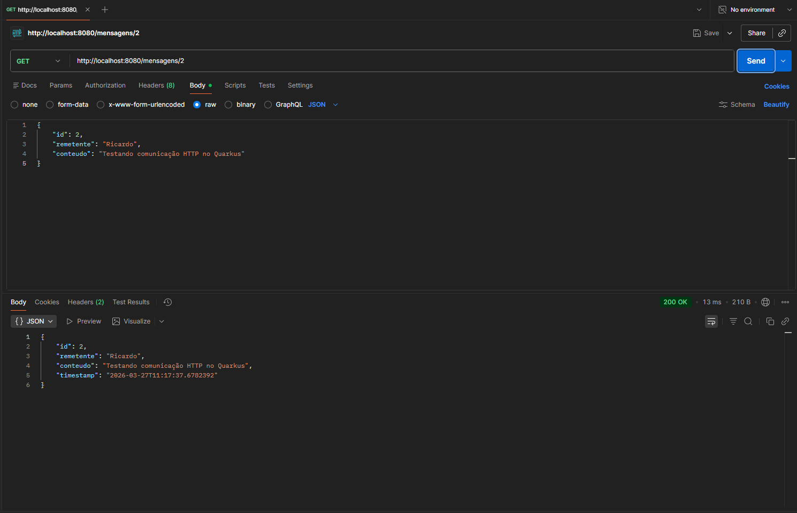
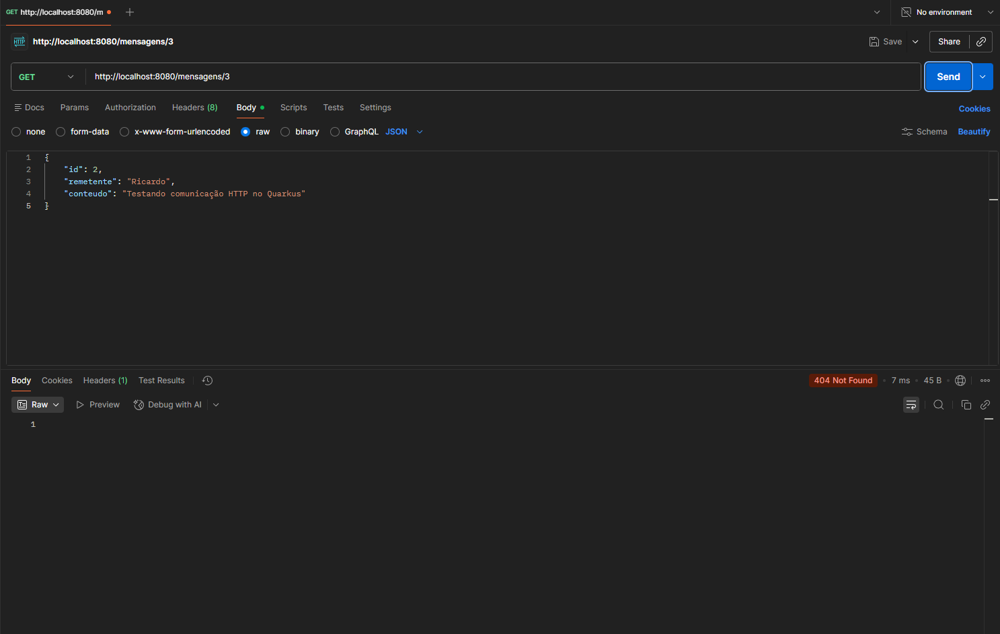
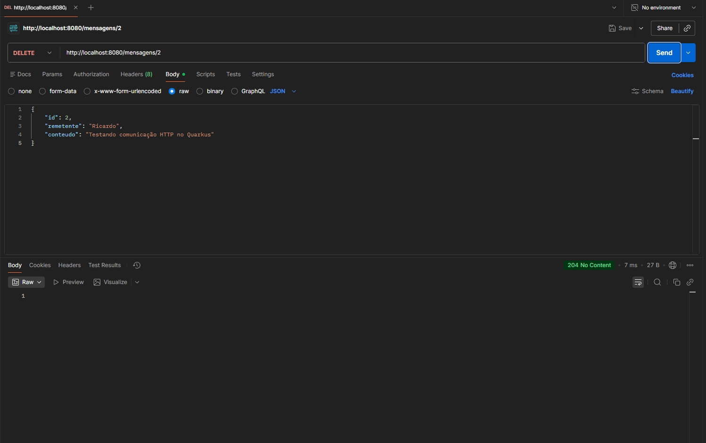

# Relatório Técnico: Sistema de Mensagens Distribuído com Quarkus

Este projeto implementa uma aplicação distribuída simples utilizando o framework Quarkus, explorando o protocolo HTTP como mecanismo de comunicação direta entre processos no modelo client-server.

## 4.1 Arquitetura da Solução

### Fluxo de uma Requisição POST /mensagens

O fluxo de comunicação demonstra o modelo de interação entre dois processos distintos na rede:

- Sender (Cliente/Postman):  
  Atua como o emissor da mensagem. O Postman encapsula os dados da classe Mensagem (id, remetente, conteúdo) em um objeto JSON.  
  Esta carga útil (payload) é inserida no corpo de uma requisição HTTP.

- Protocolo HTTP:  
  Funciona como a camada de aplicação que abstrai a complexidade do TCP.  
  Utiliza cabeçalhos (como Content-Type: application/json) para informar ao destinatário como interpretar os dados recebidos.

- Receiver (Quarkus):  
  O framework Quarkus atua como o receptor. Ele expõe um endpoint que "escuta" na porta 8080.  
  Ao receber a requisição, o motor RESTEasy Reactive realiza o unmarshalling (conversão de JSON para objeto Java) e armazena a mensagem em uma lista em memória.

### Mapeamento Teórico (Send e Receive)

As operações do protocolo HTTP mapeiam-se diretamente aos conceitos de comunicação entre processos (IPC):

- POST:  
  Equivale à primitiva Send. O emissor envia dados para o sistema remoto para alterar seu estado (criar um recurso).

- GET:  
  Representa uma operação de Request-Reply. O cliente solicita dados e o servidor responde.

- DELETE:  
  Atua como uma primitiva de Controle/Envio, onde uma instrução de remoção é enviada para sincronizar o estado distribuído.

## 4.2 Evidências de Funcionamento

### Tabela de Testes

| Método | Rota              | Descrição                      | Status HTTP    | Evidência            |
|--------|-------------------|--------------------------------|----------------|----------------------|
| POST   | /mensagens        | Criação de uma nova mensagem  | 201 Created    |     |
| GET    | /mensagens        | Listagem de mensagens         | 200 OK         |     |
| GET    | /mensagens/{id}   | Busca por ID existente        | 200 OK         |     |
| GET    | /mensagens/{id}   | Busca por ID inexistente      | 404 Not Found  |     |
| DELETE | /mensagens/{id}   | Remoção de mensagem           | 204 No Content |     |

### Justificativa dos Status Codes

- 200 OK:  
  Indica que a requisição GET foi processada com sucesso e os dados estão no corpo da resposta.

- 201 Created:  
  Confirma que a requisição POST criou um novo recurso no servidor.

- 404 Not Found:  
  Retornado quando o recurso solicitado não existe (erro lógico de endereçamento).

- 204 No Content:  
  Indica que a operação DELETE foi bem-sucedida, mas não há conteúdo na resposta.

## Como Executar o Projeto

1. Certifique-se de ter o JDK 17 ou superior instalado.

2. Inicie a aplicação em modo de desenvolvimento:

```bash
./mvnw quarkus:dev
```

3. A aplicação estará disponível em:

http://localhost:8080
